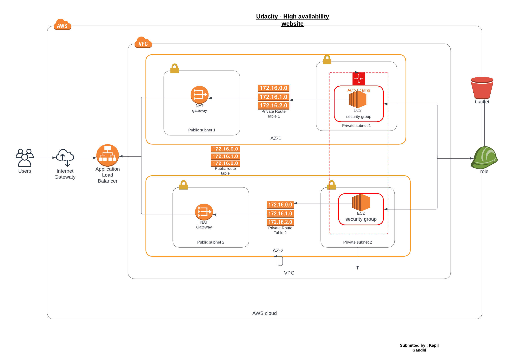

# Project 2 Deploy a high availability web app using cloudformation



## Introduction

In this project, we will deploy web servers for a highly available web app using CloudFormation. Requirements are listed below:

Server specs

You'll need to create a Launch Configuration for your application servers in order to deploy four servers, two located in each of your private subnets. The launch configuration will be used by an auto-scaling group.
You'll need two vCPUs and at least 4GB of RAM. The Operating System to be used is Ubuntu 18. So, choose an Instance size and Machine Image (AMI) that best fits this spec.
Be sure to allocate at least 10GB of disk space so that you don't run into issues.

Security Groups and Roles

Since you will be downloading the application archive from an S3 Bucket, you'll need to create an IAM Role that allows your instances to use the S3 Service.
Udagram communicates on the default HTTP Port: 80, so your servers will need this inbound port open since you will use it with the Load Balancer and the Load Balancer Health Check. As for outbound, the servers will need unrestricted internet access to be able to download and update their software.

The load balancer should allow all public traffic (0.0.0.0/0) on port 80 inbound, which is the default HTTP port. Outbound, it will only be using port 80 to reach the internal servers

The application needs to be deployed into private subnets with a Load Balancer located in a public subnet.
One of the output exports of the CloudFormation script should be the public URL of the LoadBalancer. Bonus points if you add http:// in front of the load balancer DNS Name in the output, for convenience.

## Website link

The project is available at: http://udase-webap-43ykne3k2ey8-1945455030.us-east-1.elb.amazonaws.com/

## Instructions

```
a) Step-1

C> aws cloudformation create-stack --stack-name udaNetwork --region us-east-1 --template-body file://network.yml --parameters file://network.json --capabilities "CAPABILITY_IAM" "CAPABILITY_NAMED_IAM" --profile gannu2
{
    "StackId": "arn:aws:cloudformation:us-east-1:404190891643:stack/udaNetwork/e16f4180-2e11-11ed-ad0f-0e87df064301"
}
```

```
b) Step-2

C> aws cloudformation create-stack --stack-name udaServers --region us-east-1 --template-body file://servers.yml --parameters file://servers.json --capabilities "CAPABILITY_IAM" "CAPABILITY_NAMED_IAM" --profile gannu2
{
    "StackId": "arn:aws:cloudformation:us-east-1:404190891643:stack/udaServers/e94e6a00-2e13-11ed-b59b-0a87db62bdd5"
}

Resources:
1. network.yml      - Network Specifications
2. server.yml       - server Specifications
3. network.json     - Network Parameters
4. servers.json     - Server Paramters
5. Infra digram     
6. Evidence Document    
7. Udacity.zip and 
8. Index.html
